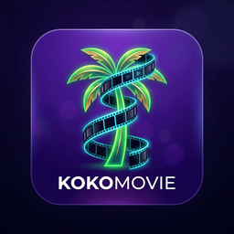

<div align="center">



# KokoMovie

**All your movies and TV shows in one beautiful app — free, no subscriptions, no clutter.**

[](https://github.com/Noobiez16/KokoMovie/releases)
[](#-download)
[](#-automatic-updates)

</div>

---

## 📥 Download

Pick your system and click to grab the latest version from the
**[Releases page](https://github.com/Noobiez16/KokoMovie/releases/latest)**:

<div align="center">

[](https://github.com/Noobiez16/KokoMovie/releases/latest)
&nbsp;
[](https://github.com/Noobiez16/KokoMovie/releases/latest)
&nbsp;
[](https://github.com/Noobiez16/KokoMovie/releases/latest)

</div>

> **On macOS?** A ready-made installer isn't published yet. You can build the app
> yourself — see [For Developers](#-for-developers) below.

---

## ✨ What is KokoMovie?

KokoMovie is a desktop app that brings movies and TV shows together in one place,
with a clean, modern interface. Search for anything, hit **Watch**, and it finds a
working stream for you automatically — no juggling websites, pop-ups, or sign-ups.

- 🎬 **A real catalog** — posters, ratings, cast, and descriptions for thousands of titles
- ▶️ **One-click play** — KokoMovie finds a working stream and starts playing
- 📺 **Built-in player** — quality options, subtitles, Picture-in-Picture, and keyboard shortcuts
- 💾 **On-device storage** — watchlists, history, and preferences are stored locally on your machine
- ⬇️ **Watch offline** — download titles (securely encrypted) for when you're without internet
- 🔄 **Always up to date** — the app updates itself in the background

---

## 🔄 Automatic Updates

You only download KokoMovie once. After that, it **checks for new versions on its own**
and installs them quietly in the background — the next time you open the app, you're
already on the latest version. No re-downloading, no reinstalling.

> 💡 On Linux, automatic updates work with the **AppImage** version. The `.deb` package
> is updated like other system apps when you reinstall it.

---

## 🚀 Getting Started

1. **Download and install** KokoMovie for your system (buttons above).
2. **Add a free TMDB key** so the catalog fills with movies and shows
   (one-time, 2 minutes — see below).
3. **Browse or search**, click any poster, and press **Watch**. That's it.

### Getting your free TMDB key

KokoMovie uses [TMDB](https://www.themoviedb.org/) (the same free movie database behind
many popular apps) to show posters, titles, and details. It's free and takes a minute:

1. Create a free account at [themoviedb.org](https://www.themoviedb.org/).
2. Go to **[Settings → API](https://www.themoviedb.org/settings/api)** and request a key
   (choose "Developer", non-commercial use — it's instant).
3. Copy your **API Key** or **Read Access Token**.
4. In KokoMovie, open **Settings → API Configuration**, paste the key, and click
   **Validate & Save**. Done — your key is stored securely on your device.

---

## ❓ FAQ

**Is it free?** Yes. There are no subscriptions or accounts to pay for.

**Where do the movies come from?** KokoMovie doesn't host any videos. When you press
Watch, it locates a stream from third-party sources — the same ones you'd find browsing
the web — and plays it in its built-in player.

**Do I need the TMDB key?** Yes, to see the catalog. It's free and one-time (steps above).

**Will my data be uploaded anywhere?** No. Your watchlist, preferences, and viewing history are stored locally in an on-device SQLite database.

---

<details>
<summary><h2>🛠️ For Developers</h2></summary>

KokoMovie is a fully local Electron + React desktop application. All state (watchlists, settings, playback positions) is managed on-device via SQLite. Metadata is fetched directly from TMDB; streams are located by loading third-party embed pages in a sandboxed hidden window and intercepting the video URL.

> ⚠️ **Legacy code**: The `services/` directory contains legacy microservices and backend infrastructure (Docker Compose, PostgreSQL, Redis, DynamoDB Local) from previous hosted versions. These are now completely unused and deprecated.

### Prerequisites

- Node.js 22+, npm 10+
- A free [TMDB API key](https://www.themoviedb.org/settings/api)

### Run locally

```bash
git clone https://github.com/Noobiez16/KokoMovie
cd KokoMovie
npm install
npm run dev:client
```

This starts the main compiler in watch mode and launches the Electron application on your desktop.

### Project structure

```
KokoMovie/
├── client/                 # Electron app
│   └── src/
│       ├── main/           # Main process (Node.js): providers, stream-extractor, local SQLite DB, IPC
│       └── renderer/       # React app (Vite): pages, components, local API connectors
├── services/               # [DEPRECATED] Unused legacy microservices
└── docker-compose.yml      # [DEPRECATED] Unused legacy Docker setup
```

### Development commands

| Command | Description |
|---|---|
| `npm run dev:client` | Start the Electron/Vite client locally |
| `npm run build` | Build the production bundle |
| `npm run lint` | Run ESLint |

### Building installers

```bash
# Linux (.AppImage + .deb)  →  client/release/linux/
sudo apt install build-essential python3 libsecret-1-dev
cd client && npm run dist:linux

# Windows (.exe)  →  client/release/windows/   (run on Windows)
cd client && npm run dist:win

# macOS (.dmg)  →  client/release/mac/   (run on a Mac; needs Apple signing for notarization)
cd client && npm run dist:mac
```

### Releasing (auto-update pipeline)

Releases are built by GitHub Actions (`.github/workflows/electron-release.yml`) on any
`v*` tag. The workflow builds Windows + Linux, then publishes the installers **plus the
`latest.yml` / `latest-linux.yml` and `.blockmap` files** to a GitHub Release.

```bash
git tag v1.0.4-beta
git push origin v1.0.4-beta
```

Auto-update is configured in `client/src/main/updater.ts` and the `publish:` block of
each `client/electron-builder.*.yml`.

### Tech stack

**Client:** Electron 31 · React 19 · Vite 5 · TypeScript · SQLite 3 (via `better-sqlite3`) · TanStack Query v5 · Zustand v5 · hls.js v1.5

</details>

---

## ⚖️ Legal Notice

KokoMovie does not host, store, or distribute any video content. All streams are located
by loading third-party embed pages in a sandboxed browser context, at the user's explicit
request — equivalent to visiting those pages in your own browser. Use of third-party
streaming sites is subject to their terms of service and the law in your jurisdiction.
This project is for personal and educational use only.
